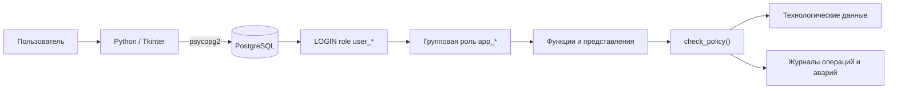

# АСУ ТП «Автоматика»
Учебный проект подсистемы администрирования и контроля АСУ ТП для производства железобетонных конструкций. 
Проект объединяет настольный клиент на **Python/Tkinter** и серверную часть на **PostgreSQL**, где реализованы 
хранение технологических данных, ролевая модель доступа, операции изменения данных и аудит действий 
пользователей.
это изменение
> Проект предназначен для обучения и технического портфолио. Это не промышленная SCADA-система, не сертифицированное средство защиты информации и не готовое решение для эксплуатации на реальном производстве.

## Что реализовано

В приложении представлены основные сценарии работы с данными АСУ ТП:

- просмотр технологических параметров;
- разделение открытых и ограниченных параметров;
- просмотр и подтверждение аварийных событий;
- изменение технологических параметров с контролем допустимых границ;
- автоматическое создание аварийного события при выходе значения за пределы;
- просмотр истории изменений параметров;
- управление учетными записями;
- блокировка, разблокировка и смена пароля пользователей;
- просмотр журнала операций и журнала входов/выходов;
- отображение матрицы прав непосредственно из БД;
- экспорт таблиц интерфейса в CSV.

## Механизмы безопасности

Проект демонстрирует несколько уровней контроля доступа.

1. Каждый пользователь приложения подключается к PostgreSQL под собственной LOGIN-ролью вида `user_<login>`.
2. LOGIN-роли получают одну из групповых ролей `app_*`.
3. Прямой доступ прикладных ролей к базовым таблицам и последовательностям отозван.
4. Основные операции выполняются через разрешенные функции PostgreSQL.
5. Функции дополнительно проверяют прикладную матрицу `roles` / `permissions` / `role_permissions` через `check_policy()`.
6. Критические функции созданы как `SECURITY DEFINER` с фиксированным `search_path = asu_schema, pg_temp`.
7. В Python-запросах используются параметры `psycopg2`, а пользовательские значения не подставляются в SQL строковой конкатенацией.
8. Действия пользователей записываются в `access_log`; для соединения сохраняется адрес, доступный через `inet_client_addr()`.
9. Блокировка учетной записи синхронизируется с атрибутом PostgreSQL `LOGIN/NOLOGIN`.
10. Триггер защищает последнего активного администратора ИС от блокировки или удаления.

Подробнее: [`docs/security-design.md`](docs/security-design.md).

## Архитектура



Клиентский интерфейс определяет доступные рабочие вкладки, но основная серверная проверка прав находится в PostgreSQL. Поэтому пользователь не получает прямой доступ к таблицам только за счет обхода GUI.

## Роли пользователей

| Роль | Основные разделы GUI |
|---|---|
| Непривилегированный | Общедоступные технологические параметры |
| Оператор | Рабочие параметры, активные аварии, подтверждение аварий |
| Привилегированный | Все технологические параметры, изменение значений, история изменений |
| Инженер | Все технологические параметры, изменение значений, история изменений |
| Администратор ИС | Пользователи, создание/обновление, блокировка/разблокировка, смена пароля |
| Администратор ИБ | Полный журнал операций, входы/выходы, просмотр пользователей |

В БД матрица разрешений хранится отдельно от интерфейса. Администратор ИС, например, имеет серверные разрешения на ряд технологических операций, хотя его рабочий GUI ориентирован прежде всего на администрирование пользователей. Актуальную матрицу приложение получает через `f_get_access_matrix()`.

### Матрица серверных разрешений

| Разрешение | Неприв. | Оператор | Привил. | Инженер | Адм. ИС | Адм. ИБ |
|---|:---:|:---:|:---:|:---:|:---:|:---:|
| `READ:PUBLIC_PARAMS` | ✓ | ✓ | ✓ | ✓ | ✓ | ✓ |
| `READ:ALARMS` | — | ✓ | ✓ | ✓ | ✓ | ✓ |
| `CONFIRM:ALARM` | — | ✓ | ✓ | ✓ | ✓ | — |
| `READ:ALL_PARAMS` | — | — | ✓ | ✓ | ✓ | — |
| `WRITE:PARAMETER` | — | — | ✓ | ✓ | ✓ | — |
| `READ:CHANGE_LOG` | — | — | ✓ | ✓ | ✓ | ✓ |
| `READ:USERS` | — | — | — | — | ✓ | ✓ |
| `MANAGE:USERS` | — | — | — | — | ✓ | — |
| `READ:ACCESS_LOG` | — | — | — | — | — | ✓ |
| `READ:RIGHTS_MATRIX` | — | — | — | — | ✓ | ✓ |

## Структура проекта

```text
test/
├── src/
│   ├── gui.py                  # основной Tkinter-интерфейс
│   ├── db_connection.py        # подключение к PostgreSQL
│   ├── db_helpers.py           # общий слой выполнения запросов
│   ├── auth.py                 # сведения о текущем пользователе и роли
│   ├── dashboard_ops.py        # сводка и матрица доступа
│   ├── operators.py            # операции оператора
│   ├── privileged_ops.py       # параметры и история изменений
│   ├── admin_ops.py            # управление пользователями
│   ├── audit_ops.py            # входы/выходы
│   ├── ib_ops.py               # полный журнал операций
│   ├── unprivileged_ops.py     # открытые параметры
│   ├── config.py               # параметры приложения и соединения
│   └── utils.py                # вспомогательные функции
├── database/
│   ├── 01_schema.sql           # схема, данные, роли, функции, права и триггеры
│   ├── 02_accounts.sql         # шесть демонстрационных LOGIN-ролей PostgreSQL
│   ├── 03_demo_seed.sql        # массовые синтетические данные
│   └── 04_security_checks.sql  # структурные проверки БД и прав
├── docs/
│   ├── security-design.md
│   ├── security-test-plan.md
│   └── portfolio-changes.md
├── screenshots/
├── demo_creditions.txt         # демонстрационные логины и пароли
├── .env.example
├── .gitignore
└── requirements.txt
```

## Требования для запуска

- PostgreSQL с возможностью создавать роли и базу данных;
- Python 3 с установленным Tkinter;
- `psycopg2-binary` из `requirements.txt`.

SQL-часть проекта написана с ориентацией на **PostgreSQL 9.6**, а окно «О программе» отражает исходную учебную среду **Astra Linux «Орел» 1.7.5 / Python 3.5.3 / PostgreSQL 9.6**. Для обычного локального воспроизведения проекта можно использовать современную версию Python 3, совместимую с текущим `psycopg2-binary`.

## Развертывание базы данных

База должна называться `asu_tp_db`, если вы не изменяете переменную `ASUTP_DB_NAME`.

### Вариант 1 — pgAdmin

1. Подключитесь к PostgreSQL под администратором, например `postgres`.
2. Создайте базу данных `asu_tp_db`.
3. Откройте для этой базы **Query Tool**.
4. Выполните скрипты по порядку:

```text
01_schema.sql
02_accounts.sql
03_demo_seed.sql        # необязательно, только для большого набора demo-данных
04_security_checks.sql  # необязательно, проверка структуры и прав
```

`01_schema.sql` уже содержит минимальный набор пользователей, технологических объектов, записей журнала и аварий, поэтому `03_demo_seed.sql` нужен только для более наполненной демонстрации интерфейса.

### Вариант 2 — psql

```bash
createdb -U postgres asu_tp_db
psql -U postgres -d asu_tp_db -f database/01_schema.sql
psql -U postgres -d asu_tp_db -f database/02_accounts.sql
psql -U postgres -d asu_tp_db -f database/03_demo_seed.sql
psql -U postgres -d asu_tp_db -f database/04_security_checks.sql
```

Скрипты создания ролей должны выполняться пользователем PostgreSQL с необходимыми административными полномочиями.

## Настройка Python

Из корня проекта создайте виртуальное окружение:

```bash
python -m venv .venv
```

Windows PowerShell:

```powershell
.venv\Scripts\Activate.ps1
python -m pip install -r requirements.txt
python src\gui.py
```

Windows без активации окружения:

```powershell
.venv\Scripts\python.exe -m pip install -r requirements.txt
.venv\Scripts\python.exe src\gui.py
```

Linux:

```bash
source .venv/bin/activate
python -m pip install -r requirements.txt
python src/gui.py
```

## Настройки подключения

По умолчанию клиент использует:

```text
host: localhost
port: 5432
database: asu_tp_db
sslmode: disable
```

Параметры можно изменить переменными окружения:

| Переменная | Назначение | Значение по умолчанию |
|---|---|---|
| `ASUTP_DB_HOST` | сервер PostgreSQL | `localhost` |
| `ASUTP_DB_PORT` | порт | `5432` |
| `ASUTP_DB_NAME` | база данных | `asu_tp_db` |
| `ASUTP_DB_SSLMODE` | режим SSL psycopg2 | `disable` |
| `ASUTP_CONNECT_TIMEOUT` | тайм-аут соединения | `5` |
| `ASUTP_MAX_LOGIN_ATTEMPTS` | попытки входа в текущем окне | `3` |
| `ASUTP_DEBUG` | вывод технических ошибок в консоль | `0` |

`.env.example` является только примером: приложение **не загружает `.env` автоматически**. Переменные нужно задать средствами операционной системы перед запуском.

Пример PowerShell для нестандартного порта:

```powershell
$env:ASUTP_DB_HOST = "127.0.0.1"
$env:ASUTP_DB_PORT = "5433"
python src\gui.py
```

## Демонстрационные учетные записи

`02_accounts.sql` создает шесть локальных демонстрационных LOGIN-ролей с заранее заданными паролями. Те же данные собраны в [`demo_creditions.txt`](demo_creditions.txt).

| Роль | Логин в GUI | PostgreSQL LOGIN | Пароль |
|---|---|---|---|
| Непривилегированный | `unprivileged` | `user_unprivileged` | `unpriv123` |
| Оператор | `operator` | `user_operator` | `pass123` |
| Привилегированный | `privileged` | `user_privileged` | `priv123` |
| Инженер | `engineer` | `user_engineer` | `pass123` |
| Администратор ИС | `admin` | `user_admin` | `admin123` |
| Администратор ИБ | `ib_admin` | `user_ib_admin` | `ib123` |

В GUI можно вводить короткий логин: `db_connection.normalize_login()` автоматически добавляет префикс `user_`.

> Эти учетные данные предназначены только для локального учебного стенда и специально опубликованы вместе с проектом. Их нельзя использовать в реальных системах или других сервисах.

## Демонстрационное наполнение

`03_demo_seed.sql` добавляет:

- 60 синтетических неактивных записей пользователей приложения;
- 120 дополнительных технологических объектов;
- 700 записей журнала операций;
- 250 записей журнала аварий.

Для этих 60 синтетических пользователей LOGIN-роли PostgreSQL не создаются: они служат только для наполнения таблиц и журналов.

## Проверка работы

После запуска `python src/gui.py` удобно проверить проект последовательно:

1. Войти как `unprivileged` и убедиться, что доступны только открытые параметры.
2. Войти как `operator`, открыть аварии и подтвердить одну из активных записей.
3. Войти как `engineer` или `privileged`, изменить параметр и посмотреть его историю.
4. Войти как `admin`, проверить список пользователей, блокировку/разблокировку и смену пароля.
5. Войти как `ib_admin` и проверить полный журнал операций и журнал входов/выходов.

Подробный сценарий: [`docs/security-test-plan.md`](docs/security-test-plan.md).

## Ограничения проекта

- ограничение числа неуспешных входов действует только в рамках текущего окна авторизации; после закрытия приложения счетчик не сохраняется;
- демонстрационные пароли находятся в репозитории намеренно и не предназначены для реального использования;
- проект не моделирует PLC/RTU, промышленные протоколы, физический технологический контур или сетевую сегментацию реальной АСУ ТП;
- `04_security_checks.sql` выполняет структурные проверки от административной сессии и не заменяет проверки поведения под каждой пользовательской ролью;
- для удаленного подключения к PostgreSQL необходимо отдельно настроить сервер, сетевой доступ и подходящий `sslmode`.

## Документация

- [`docs/security-design.md`](docs/security-design.md) — архитектура и механизмы безопасности;
- [`docs/security-test-plan.md`](docs/security-test-plan.md) — сценарии ручной проверки;
- [`docs/portfolio-changes.md`](docs/portfolio-changes.md) — технический обзор текущей структуры проекта и связь модулей.
